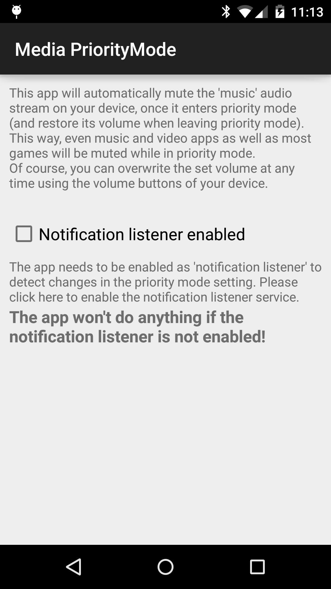
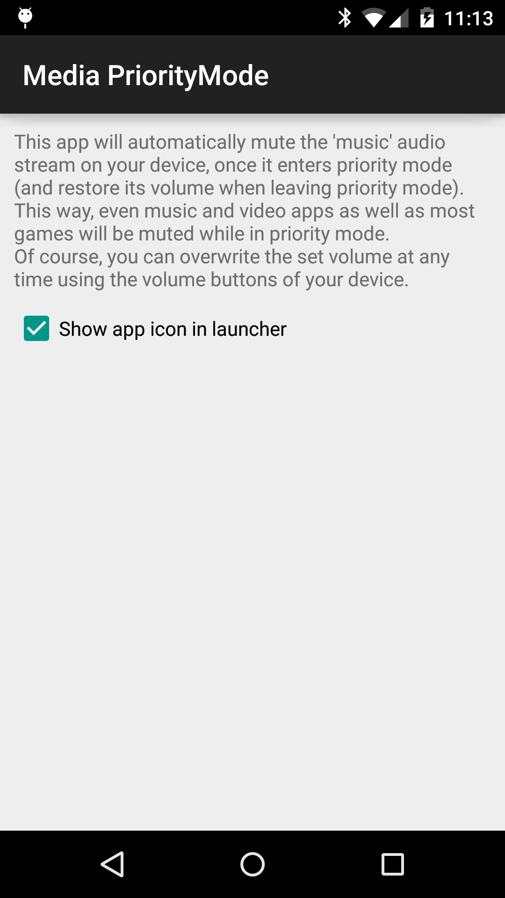

Media-Mute
===========

When enabling the "silent mode" (Android 4.x) or the "priority mode" (Android 5.0), apps are still able to play sounds through the "music" audio stream.
So music or video apps and games can still play music, even when the device should be muted.
"Media-Mute" automatically detects, when you enter silent/priority mode and then sets the volume of the "music" audio stream to 0, muting even media apps and most games. When leaving silent/priority mode, the app restores your old volume.
Additionally, you can always overwrite the set volume by just increasing the volume with your hardware volume buttons while a video is playing.

<table sytle="border: 0px;">
<tr>
<td></td>
<td></td>
</tr>
</table>